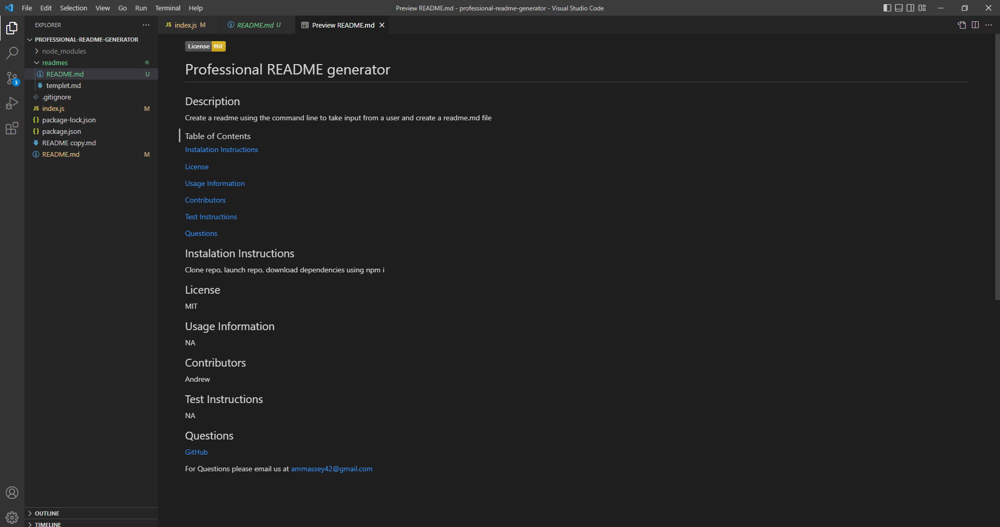

# professional-readme-generator

## Description
This project is to create a README generator taking in user input from a console and turning that input into a README.md file. In this project i used Primarily JavaScript. I used the inquirer package from npmjs.com. I also created a templet README.md file to get the formating for my generated README file.

## Installation
Clone Repo
open repo
instal dependincies using: npm i
run index.js

## Screenshots

## Link to walkthrough video

[Walkthrough Video](https://app.castify.com/view/0b1f9a61-84d3-4aaa-904e-3487272e3a3f)
